# PHÂN TÍCH THIẾT KẾ CƠ SỞ DỮ LIỆU - ORDERRESTAURANT

Tài liệu này mô tả cấu trúc cơ sở dữ liệu dựa trên đặc tả chức năng, đảm bảo tính nhất quán, khả năng mở rộng và tuân thủ các tiêu chuẩn thực tế (Soft Delete, Auditing).

---

## 1. SƠ ĐỒ QUAN HỆ THỰC THỂ (ER DIAGRAM)

```mermaid
erDiagram
    ROLES ||--o{ USERS : "has"
    USERS ||--o{ ORDERS : "places"
    USERS ||--o{ LOYALTY_POINTS : "accumulates"
    CATEGORIES ||--o{ DISHES : "contains"
    AREAS ||--o{ TABLES : "contains"
    TABLES ||--o{ ORDERS : "associates"
    ORDERS ||--o{ ORDER_ITEMS : "contains"
    DISHES ||--o{ ORDER_ITEMS : "ordered_in"
    ORDERS ||--|| PAYMENTS : "finalized_by"
    VOUCHERS ||--o{ ORDERS : "applied_to"

    USERS {
        long id PK
        string full_name
        string email UK
        string password
        string phone
        long role_id FK
        int points
        timestamp deleted_at
    }

    ROLES {
        long id PK
        string name
        string description
    }

    CATEGORIES {
        long id PK
        string name
        string description
        string image_url
        timestamp deleted_at
    }

    DISHES {
        long id PK
        string name
        string description
        decimal price
        string image_url
        long category_id FK
        boolean is_available
        timestamp deleted_at
    }

    AREAS {
        long id PK
        string name
        timestamp deleted_at
    }

    TABLES {
        long id PK
        string table_number
        int capacity
        string status "FREE, OCCUPIED, RESERVED, CLEANING"
        long area_id FK
        timestamp deleted_at
    }

    ORDERS {
        long id PK
        long customer_id FK "Optional"
        long staff_id FK
        long table_id FK
        decimal total_amount
        decimal discount_amount
        decimal final_amount
        string status "PENDING, PROCESSING, READY, COMPLETED, CANCELLED"
        string notes
        long voucher_id FK
        timestamp created_at
        timestamp deleted_at
    }

    ORDER_ITEMS {
        long id PK
        long order_id FK
        long dish_id FK
        int quantity
        decimal price_at_order
        string status "PENDING, COOKING, DONE"
        string notes
    }

    PAYMENTS {
        long id PK
        long order_id FK
        decimal amount
        string method "CASH, CARD, MOMO, VNPAY"
        string status "SUCCESS, FAILED"
        string transaction_id
        timestamp payment_date
    }

    VOUCHERS {
        long id PK
        string code UK
        string discount_type "PERCENT, FIXED"
        decimal value
        decimal min_order_value
        timestamp start_date
        timestamp end_date
        timestamp deleted_at
    }

    LOYALTY_POINTS {
        long id PK
        long user_id FK
        int points_changed
        string reason
        timestamp created_at
    }
```

---

## 2. CHI TIẾT CÁC BẢNG (TABLE DEFINITIONS)

### 2.1. Quản lý Người dùng & Phân quyền
- **Bảng `roles`**: Lưu các quyền (ADMIN, STAFF, CHEF, CUSTOMER).
- **Bảng `users`**:
    - `password`: Lưu dưới dạng Bcrypt hash.
    - `deleted_at`: Dùng cho **Soft Delete**. Nếu khác NULL là tài khoản đã bị xóa/khóa.
    - `points`: Lưu tổng điểm hiện tại của khách hàng.

### 2.2. Quản lý Thực đơn (Menu)
- **Bảng `categories`**: Phân loại món ăn.
- **Bảng `dishes`**:
    - `price`: Kiểu `decimal(19,2)` để đảm bảo độ chính xác tiền tệ.
    - `is_available`: Dùng để Chef bật/tắt món nhanh khi hết nguyên liệu mà không cần xóa món.
    - `deleted_at`: Soft Delete cho món ăn.

### 2.3. Quản lý Sơ đồ Nhà hàng
- **Bảng `areas`**: Khu vực (Tầng 1, Sân vườn, VIP).
- **Bảng `tables`**:
    - `status`: Quản lý trạng thái bàn thời gian thực cho Staff.
    - `area_id`: Liên kết vùng.

### 2.4. Quản lý Đơn hàng & Chế biến
- **Bảng `orders`**:
    - `customer_id`: Có thể Null nếu là khách vãng lai (Guest).
    - `status`: Theo dõi vòng đời đơn hàng (Chờ xác nhận -> Đang nấu -> Hoàn thành).
    - `discount_amount`: Số tiền giảm giá từ Voucher.
- **Bảng `order_items`**:
    - `price_at_order`: Lưu giá tại thời điểm đặt để tránh sai lệch khi Admin thay đổi giá Menu sau này.
    - `status`: Dành riêng cho Chef theo dõi từng món trong Order (Đang nấu từng món).

### 2.5. Thanh toán & Ưu đãi
- **Bảng `payments`**: Lưu vết giao dịch. Tương thích với các cổng thanh toán (MoMo, VnPay).
- **Bảng `vouchers`**: Lưu thông tin khuyến mãi.
- **Bảng `loyalty_points`**: Nhật ký thay đổi điểm (Lịch sử tích điểm/tiêu điểm).

---

## 3. CÁC QUY TẮC CHUẨN THỰC TẾ (BEST PRACTICES)

### 3.1. Soft Delete (Xóa mềm)
Tất cả các bảng chính mang tính logic kinh doanh (`users`, `dishes`, `categories`, `tables`, `orders`, `vouchers`) đều có cột `deleted_at` (timestamp).
- **Khi xóa**: Cập nhật `deleted_at = current_timestamp`.
- **Khi truy vấn**: Luôn thêm điều kiện `WHERE deleted_at IS NULL`.
- **Lợi ích**: Giữ lại data phục vụ báo cáo/thống kê và khả năng khôi phục.

### 3.2. Auditing (Kiểm soát vết)
Mọi bảng trong hệ thống đều nên có các cột ẩn sau (thường được Framework như Spring Data JPA tự động xử lý):
- `created_at`: Thời điểm tạo.
- `updated_at`: Thời điểm cập nhật cuối.
- `created_by`: ID người tạo.
- `updated_by`: ID người sửa cuối.

### 3.3. Quy tắc đặt tên & Kiểu dữ liệu
- **Naming**: Sử dụng `snake_case` cho tên bảng và cột (Chuẩn SQL).
- **Primary Key**: Sử dụng `bigint` auto-increment cho khả năng mở rộng lâu dài.
- **Currency**: Luôn dùng `decimal` thay vì `float/double` để tránh sai lệch làm tròn tiền.
- **Indexing (Chỉ mục)**: Cần đánh index trên các cột hay tìm kiếm: `email`, `phone`, `order_status`, `dish_name`.

### 3.4. Ràng buộc (Constraints)
- Foreign Keys đầy đủ để đảm bảo toàn vẹn dữ liệu.
- Unique constraints trên `email`, `phone`, `voucher_code`.
- Check constraints (nếu cần) cho giá tiền > 0.

---

## 4. TỔNG KẾT DANH SÁCH BẢNG VÀ THUỘC TÍNH (SUMMARY TABLE)

| Tên Bảng | Cấu trúc Thuộc tính (Data Type) |
| :--- | :--- |
| **roles** | id(bigint), name(varchar(50)), description(varchar(255)) |
| **users** | id(bigint), full_name(varchar(100)), email(varchar(100)), password(varchar(255)), phone(varchar(20)), role_id(bigint), points(int), created_at(timestamp), updated_at(timestamp), deleted_at(timestamp) |
| **categories** | id(bigint), name(varchar(100)), description(varchar(255)), image_url(text), created_at(timestamp), updated_at(timestamp), deleted_at(timestamp) |
| **dishes** | id(bigint), name(varchar(150)), description(text), price(decimal(19,2)), image_url(text), category_id(bigint), is_available(boolean), created_at(timestamp), updated_at(timestamp), deleted_at(timestamp) |
| **areas** | id(bigint), name(varchar(100)), created_at(timestamp), updated_at(timestamp), deleted_at(timestamp) |
| **tables** | id(bigint), table_number(varchar(20)), capacity(int), status(varchar(50)), area_id(bigint), created_at(timestamp), updated_at(timestamp), deleted_at(timestamp) |
| **orders** | id(bigint), customer_id(bigint), staff_id(bigint), table_id(bigint), total_amount(decimal(19,2)), discount_amount(decimal(19,2)), final_amount(decimal(19,2)), status(varchar(50)), notes(text), voucher_id(bigint), created_at(timestamp), updated_at(timestamp), deleted_at(timestamp) |
| **order_items** | id(bigint), order_id(bigint), dish_id(bigint), quantity(int), price_at_order(decimal(19,2)), status(varchar(50)), notes(text) |
| **payments** | id(bigint), order_id(bigint), amount(decimal(19,2)), method(varchar(50)), status(varchar(50)), transaction_id(varchar(255)), payment_date(timestamp) |
| **vouchers** | id(bigint), code(varchar(50)), discount_type(varchar(20)), value(decimal(19,2)), min_order_value(decimal(19,2)), start_date(timestamp), end_date(timestamp), created_at(timestamp), updated_at(timestamp), deleted_at(timestamp) |
| **loyalty_points** | id(bigint), user_id(bigint), points_changed(int), reason(varchar(255)), created_at(timestamp) |
